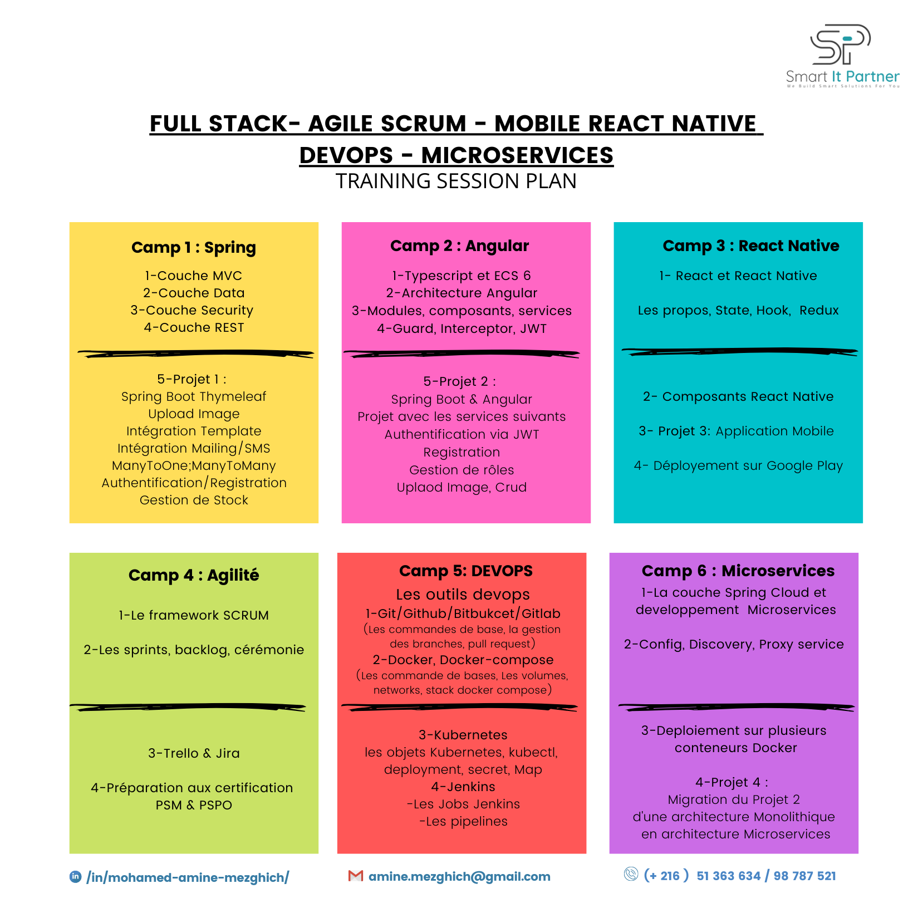

# SpringBoot Data Layer Project - Create MySQL DB

## Overview

This project is a demonstration of using Spring Boot to create a data layer for a MySQL database. The project includes the creation of entities, repositories, and controllers for managing entities and views. The database schema is automatically generated, and CRUD (create, read, update, delete) operations are implemented. Operations like ManyToOne and OneToMany are also included.
The project was created using IntelliJ IDEA Community with Maven 2.6.5 and Java version 11.0.18.

This Spring Boot project is designed to create and manage a MySQL database using Spring Data JPA. The application allows you to create, read, update, and delete entities with a user interface built using Thymeleaf. Spring Security has also been added to secure the application.

Additionally, a web template has been integrated into the project providing a user-friendly interface. Furthermore, the REST API collection has been included in the root folder of the project under the name "Rest Spring Boot Data Layer.postman_collection.json". The collection has been tested with Postman and can be used to interact with the REST API endpoints provided by the application.

The following features have been covered as part of this project :

- Creating entities with `@Entity` annotations
- Creating repositories with `@Repository` annotations
- Creating controllers with `@Controller` and `@RequestMapping` annotations
- Defining views with Thymeleaf templates
- Handling `GET` and `POST` requests with `@GetMapping` and `@PostMapping` annotations
- Configuring MySQL database connection with `application.properties`
- Performing CRUD operations on the database

## Getting Started

To run the project, you will need to have Maven and Java JDK 11 installed on your system. You can use your preferred Integrated Development Environment (IDE) to run the project. Here are the steps to run the project in IntelliJ IDEA Community:

### Step 1

Open IntelliJ IDEA Community and import the project.

### Step 2

Run the command `mvn clean install` to download the dependencies and build the project.

### Step 3

Run the command `mvn spring-boot:run` to start the application.

### Step 4

Once the application is running, you can access it by navigating to http://localhost:8081 in your web browser.

Note that the port number has been changed from the default 8080 to 8081.

## How to configure MySQL username, password and database name

To configure MySQL username, password and database name, open the application.properties file in the project and update the following properties :

spring.datasource.username: replace with your MySQL username
spring.datasource.password: replace with your MySQL password
spring.datasource.url: replace SpringBootDB with your desired database name.

## Contributing

If you would like to contribute to the project, please fork the repository and create a pull request with your proposed changes. Be sure to follow the project's coding standards and include appropriate tests with your changes.

## Dependencies

The following dependencies were used in the creation of this project:

- Spring Boot DevTools
- Spring Web Starter
- Thymeleaf
- Spring Data JPA
- MySQL Driver
- Spring Boot Starter Validation
- Spring Security Web
- Thymeleaf Extras Spring Security 5
- Spring Security Config

## Available Endpoints

## Web Interface:

- http://localhost:8081/ : Home page which serves as the index of the template.
- http://localhost:8081/provider/list : Interface to list providers with CRUD buttons.
- http://localhost:8081/provider/add : Interface to add a new provider.
- http://localhost:8081/provider/edit/{id} : Interface to edit a provider. Replace {id} in the URL with the provider's ID.
- http://localhost:8081/provider/delete/{id} : Interface to delete a provider. Replace {id} in the URL with the provider's ID.
- http://localhost:8081/provider/show/{id} : Interface to show details of a provider. Replace {id} in the URL with the provider's ID.
- http://localhost:8081/article/list : Interface to list articles with CRUD buttons.
- http://localhost:8081/article/add : Interface to add a new article.
- http://localhost:8081/article/edit/{id} : Interface to edit an article. Replace {id} in the URL with the article's ID.
- http://localhost:8081/article/delete/{id} : Interface to delete an article. Replace {id} in the URL with the article's ID.
- http://localhost:8081/article/show/{id} : Interface to show details of an article. Replace {id} in the URL with the article's ID.
- http://localhost:8081/role/list : Interface to list roles.
- http://localhost:8081/role/add : Interface to add a new role.

## REST API:

- http://localhost:8081/rest/provider/list : REST API endpoint to list providers.
- http://localhost:8081/rest/provider/add : REST API endpoint to add a new provider.
- http://localhost:8081/rest/provider/edit/{id} : REST API endpoint to edit a provider. Replace {id} in the URL with the provider's ID.
- http://localhost:8081/rest/provider/delete/{id} : REST API endpoint to delete a provider. Replace {id} in the URL with the provider's ID.
- http://localhost:8081/rest/provider/show/{id} : REST API endpoint to show details of a provider. Replace {id} in the URL with the provider's ID.

## License

This project is licensed under the MIT License - see the  file for details. Feel free to use this code in your own projects or modify it to fit your specific needs.
